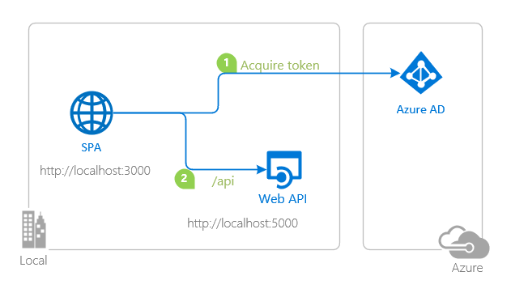

# A React single-page application using MSAL React to authorize users for calling a protected web API on Azure Active Directory

 1. [Overview](#overview)
 1. [Scenario](#scenario)
 1. [Contents](#contents)
 1. [Prerequisites](#prerequisites)
 1. [Setup](#setup)
 1. [Registration](#registration)
 1. [Running the sample](#running-the-sample)
 1. [Explore the sample](#explore-the-sample)


## Overview

This sample demonstrates a React single-page application (SPA) calling a protected Node.js web API using the [Microsoft Authentication Library for React](https://github.com/AzureAD/microsoft-authentication-library-for-js/tree/dev/lib/msal-react) (MSAL React). The Node.js web API itself is protected using the [passport-azure-ad](https://github.com/AzureAD/passport-azure-ad) plug-in for [Passport.js](http://www.passportjs.org/).

Here you'll learn how to [register a protected web API](https://docs.microsoft.com/azure/active-directory/develop/scenario-protected-web-api-app-registration), [accept authorized calls](https://docs.microsoft.com/azure/active-directory/develop/scenario-protected-web-api-verification-scope-app-roles) and [validate access tokens](https://docs.microsoft.com/azure/active-directory/develop/access-tokens#validating-tokens).

## Scenario

1. The client React SPA uses **MSAL React** to sign-in and obtain a JWT access token from **Azure AD**.
1. The access token is used as a bearer token to authorize the user to call the Node.js web API protected by **Azure AD**.
1. The protected web API responds with the claims in the **Access Token**.



## Contents

| File/folder         | Description                                         |
|---------------------|-----------------------------------------------------|
| `SPA/App.jsx`       | Main application logic resides here.                |
| `SPA/fetch.jsx`     | Provides a helper method for making fetch calls.    |
| `SPA/authConfig.js` | Contains authentication parameters for SPA project. |
| `API/config.js`     | Contains authentication parameters for API project. |
| `API/server.js`      | Main application logic of custom web API.           |

## Prerequisites

- An **Azure AD** tenant. For more information see: [How to get an Azure AD tenant](https://docs.microsoft.com/azure/active-directory/develop/quickstart-create-new-tenant)
- A user account in your **Azure AD** tenant. This sample will not work with a **personal Microsoft account**. Therefore, if you signed in to the [Azure portal](https://portal.azure.com) with a personal account and have never created a user account in your directory before, you need to do that now.

## Setup

### Step 1: Clone or download this repository

From your shell or command line:

```console
    git clone git@github.com:amin-aissous/ms-indentity-reactjs-spa-poc.git
```

or download and extract the repository .zip file.

> :warning: To avoid path length limitations on Windows, we recommend cloning into a directory near the root of your drive.

### Step 2: Install project dependencies

- Setup the service app:

```console
    npm install
```

### Register the service app (msal-react-api)

1. Navigate to the [Azure portal](https://portal.azure.com) and select the **Azure AD** service.
1. Select the **App Registrations** blade on the left, then select **New registration**.
1. In the **Register an application page** that appears, enter your application's registration information:
   - In the **Name** section, enter a meaningful application name that will be displayed to users of the app, for example `msal-react-api`.
   - Under **Supported account types**, select **Accounts in this organizational directory only**.
1. Select **Register** to create the application.
1. In the app's registration screen, find and note the **Application (client) ID**. You use this value in your app's configuration file(s) later in your code.
1. Select **Save** to save your changes.
1. In the app's registration screen, select the **Expose an API** blade to the left to open the page where you can declare the parameters to expose this app as an API for which client applications can obtain [access tokens](https://docs.microsoft.com/azure/active-directory/develop/access-tokens) for.
The first thing that we need to do is to declare the unique [resource](https://docs.microsoft.com/azure/active-directory/develop/v2-oauth2-auth-code-flow) URI that the clients will be using to obtain access tokens for this Api. To declare an resource URI, follow the following steps:
   - Select `Set` next to the **Application ID URI** to generate a URI that is unique for this app.
   - For this sample, accept the proposed Application ID URI (`api://{clientId}`) by selecting **Save**.
1. All APIs have to publish a minimum of one [scope](https://docs.microsoft.com/azure/active-directory/develop/v2-oauth2-auth-code-flow#request-an-authorization-code) for the client's to obtain an access token successfully. To publish a scope, follow the following steps:
   - Select **Add a scope** button open the **Add a scope** screen and Enter the values as indicated below:
        - For **Scope name**, use `access_as_user`.
        - Select **Admins and users** options for **Who can consent?**.
        - For **Admin consent display name** type `Access msal-react-api`.
        - For **Admin consent description** type `Allows the app to access msal-react-api as the signed-in user.`
        - For **User consent display name** type `Access msal-react-api`.
        - For **User consent description** type `Allow the application to access msal-react-api on your behalf.`
        - Keep **State** as **Enabled**.
        - Select the **Add scope** button on the bottom to save this scope.
1. Select the `Manifest` blade on the left.
   - Set `accessTokenAcceptedVersion` property to **2**.
   - Click on **Save**.

#### Configure the service app (msal-react-api) to use your app registration

Open the project in your IDE (like Visual Studio or Visual Studio Code) to configure the code.

> In the steps below, "ClientID" is the same as "Application ID" or "AppId".

1. Open the `API\config.json` file.
1. Find the key `clientID` and replace the existing value with the application ID (clientId) of `msal-react-api` app copied from the Azure portal.
1. Find the key `tenantID` and replace the existing value with your Azure AD tenant ID.

### Register the client app (msal-react-spa)

1. Navigate to the [Azure portal](https://portal.azure.com) and select the **Azure AD** service.
1. Select the **App Registrations** blade on the left, then select **New registration**.
1. In the **Register an application page** that appears, enter your application's registration information:
   - In the **Name** section, enter a meaningful application name that will be displayed to users of the app, for example `msal-react-spa`.
   - Under **Supported account types**, select **Accounts in this organizational directory only**.
   - In the **Redirect URI** section, select **Single-page application** in the combo-box and enter the following redirect URI: `http://localhost:3000/`.
1. Select **Register** to create the application.
1. In the app's registration screen, find and note the **Application (client) ID**. You use this value in your app's configuration file(s) later in your code.
1. Select **Save** to save your changes.
1. In the app's registration screen, select the **API permissions** blade in the left to open the page where we add access to the APIs that your application needs.
   - Select the **Add a permission** button and then,
     - Ensure that the **Microsoft APIs** tab is selected.
     - In the *Commonly used Microsoft APIs* section, select **Microsoft Graph**
     - In the **Delegated permissions** section, select the **User.Read** in the list. Use the search box if necessary.
     - Select the **Add permissions** button at the bottom.
   - Select the **Add a permission** button and then,
     - Ensure that the **My APIs** tab is selected.
     - In the list of APIs, select the API `msal-react-api`.
     - In the **Delegated permissions** section, select the **Access 'msal-react-api'** in the list. Use the search box if necessary.
     - Select the **Add permissions** button at the bottom.

#### Configure the client app (msal-react-spa) to use your app registration

Open the project in your IDE (like Visual Studio or Visual Studio Code) to configure the code.

> In the steps below, "ClientID" is the same as "Application ID" or "AppId".

1. Open the `\src\authConfig.js` file.
1. Find the key `Enter_the_Application_Id_Here` and replace the existing value with the application ID (clientId) of `msal-react-spa` app copied from the Azure portal.
1. Find the key `Enter_the_Tenant_Info_Here` and replace the existing value with your Azure AD tenant ID.
1. Find the key `Enter_the_Web_Api_Scope_Here` and replace the existing value with APP ID URI of the web API project that you've registered earlier, e.g. `api://****-****-********-********/access_as_user`

## Running the sample

- Run the service app:

```console
    npm start
```

## Explore the sample

1. Open your browser and navigate to `http://localhost:3000`.
1. Select the **Sign In** button on the top right corner. Choose either **Popup** or **Redirect** flows.
1. Select the **Profile** button on the navigation bar. This will make a call to the Microsoft Graph API.
1. Select the **HelloAPI** button on the navigation bar. This will make a call to your web API.

